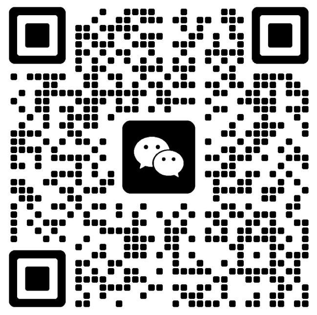

# 赛搏MCP 工具箱（桌面控制篇）

> 让小智设备 "动手"，帮助在你的 Windows 电脑上自动完成各种操作。

本仓库基于 **Model&nbsp;Context&nbsp;Protocol (MCP)**，将多种桌面自动化能力封装为可被供各类小智设备调用的 **MCP 工具（tool）**；
通过 `mcp_pipe.py` 建立 WebSocket 通道后，云端的大模型即可像调用 API 一样调用本地脚本，完成打开/关闭应用、管理 Outlook 日历与邮件、自动发送微信消息、记录工作日志等操作。

---

## 一、模块总览

| 模块               | 主要功能                                 | 关键依赖              | 运行方式示例 |
|--------------------|------------------------------------------|-----------------------|--------------|
| `app_launcher.py`  | • 打开/关闭常用桌面应用<br/>• 打开谷歌浏览器<br/>• 谷歌/百度搜索<br/>• 打开微信<br/>• 打开QQ音乐<br/>• 打开腾讯会议<br/>• 通过 Steam 启动 Dota 2 | `psutil`             | `python mcp_pipe.py app_launcher.py` |
| `outlook_manager.py` | • 增删查改 Outlook 日历事件<br/>• 发送邮件（支持附件/重要性）<br/>• 增删查改联系人 CRUD<br/>• 批量删除日历事件 | `pywin32`、`dateparser`（可选） | `python mcp_pipe.py outlook_manager.py` |
| `Wechat_Sender.py` | • 向指定联系人发送微信文字消息               | `wxauto`              | `python mcp_pipe.py Wechat_Sender.py` |
| `work_logger.py`   | • 在桌面生成 "工作日志/日期.txt" 并追加条目 | 无                    | `python mcp_pipe.py work_logger.py` |
| `start_all_services.py` | • 一键启动并守护所有上述模块            | 内置                  | `python start_all_services.py` |
| `mcp_pipe.py`      | • WebSocket ↔ 本地脚本双向管道<br/>• 自动重连 & 子进程管理 | `websockets`、`python-dotenv` | _内部调用_ |

### 实现原理剖析

1. **MCP 协议**
   - 每个脚本通过 `FastMCP("ToolName")` 注册自身为一个 MCP Server。
   - 使用装饰器 `@mcp.tool()` 暴露可调用函数，函数签名即为 _tool schema_。
   - 云端模型发送 `CallToolRequest`，脚本执行函数并返回 JSON 结果。

2. **mcp_pipe.py**
   - 启动后读取 `MCP_ENDPOINT`，与云端 Gateway 建立 **WebSocket** 连接。
   - 随即作为父进程拉起指定脚本 (`python tool.py`) 并通过 **stdio** 实现双向数据转发。
   - 如连接中断，采用指数退避策略自动重连。

3. **各业务脚本**
   - `app_launcher`: 通过 `subprocess.Popen` 打开应用，`psutil` 遍历并终止进程；浏览器搜索使用 `webbrowser.open`；Steam 启动游戏则依赖 `steam://` 协议。
   - `outlook_manager`: 基于 `pywin32` 的 COM Automation，直接调用 Outlook 对象模型；若安装 `dateparser`，可解析自然语言时间（"明天下午三点"）。
   - `Wechat_Sender`: 使用 `wxauto` 寻找微信窗口、搜索联系人并发送文本，属于 UI 自动化；需保证微信前台运行。
   - `work_logger`: 纯文件写入，无外部依赖。

4. **接通小智智能体**
   - `xiaozhi.me`: 通过 `xiaozhi.me` 网站打开"控制台"再打开"智能体"的"配置角色"，最下方右下角有一个"MCP接入点"，复制里面的接入点地址（WSS开头）到本项目的cp_pipe.py文件（可用记事本打开）第183行即可实现与小智智能体绑定，该智能体下的所有小智设备均可共享MCP服务。

---

## 二、零基础部署教程（Windows 版）

> 目标：在一台全新 Windows 10/11 电脑上，成功启动 `start_all_services.py` 并让云端 AI 能够调用本地工具。

### 0. 准备工作
- 一台联网的 Windows 10/11 PC（必须，64 位）。
- 安装好 **Git**（可选，用于克隆仓库；无则直接下载 ZIP）。
- 安装并登录：Microsoft Outlook（建议安装，否则无法实现邮件、日历提醒功能）、PC 微信、Steam + Dota 2等软件。
- 需要特别注意的是：Microsoft Outlook需要安装Classic版本（可联系进群获取，也可在网盘下载，Outlook新版不支持python工具库操作；微信版本需要再3.9.12.X以下，新版本也不支持python工具库操作。

### 1. 打开命令行
1. 按 `Win + R`，输入 `cmd` 并回车，打开 **命令提示符**。
2. 推荐右键→"以管理员身份运行"，后续操作更顺畅。

### 2. 安装 / 检查 Python
```bat
python --version
```
- 若返回版本号 ≥ **3.10**，跳到步骤 3。
- 若提示 "不是内部或外部命令"，请：
  1. 访问 <https://www.python.org/downloads/windows/> 下载 Windows 安装包 (x64 installer)。
  2. 双击安装，**务必勾选 "Add Python to PATH"**，并保持"Install for all users"。
  3. 安装完成后关闭并重新打开 CMD，再次执行 `python --version` 验证。

### 3. 获取代码
```bat
cd %USERPROFILE%\Desktop    &rem 将代码放桌面，可自行调整路径

echo ==== 克隆仓库 ====
 git clone https://github.com/<your_name>/mcp-tools.git
cd mcp-tools
```
若无 Git，可点击 GitHub **Code → Download ZIP**，解压到任意目录并 `cd` 进去。

### 4. 创建虚拟环境（可选但强烈推荐）
```bat
python -m venv .venv
call .venv\Scripts\activate
```
激活后，命令行前缀会出现 `(venv)`。

### 5. 更新 pip & 安装依赖
```bat
python -m pip install --upgrade pip
pip install -r requirements.txt
```
安装时间取决于网络；`pywin32` 体积较大，耐心等待。

> 若需要微信自动化，额外安装：
> ```bat
> pip install wxauto
> ```

### 6. 配置环境变量（MCP Endpoint）
1. 接通小智智能体
   - 通过 `xiaozhi.me` 网站打开"控制台"再打开"智能体"的"配置角色"，最下方右下角有一个"MCP接入点"，复制里面的接入点地址（WSS开头）到本项目的cp_pipe.py文件（可用记事本打开）第183行即可实现与小智智能体绑定，该智能体下的所有小智设备均可共享MCP服务。

### 7. 启动全部工具
```bat
python start_all_services.py
```
- 首次启动会在当前目录生成 `*.log` 文件，可实时查看执行情况。
- 若看到诸如 `Started app_launcher.py process`、`Processing PingRequest` 即表示已成功连接到云端。

### 8. 验证
- 打开xiaozhi.me的控制台，再打开"智能体"的"配置角色"，最下方右下角有一个"MCP接入点"，点击刷新即可出现你部署好的MCP工具，并且呈现绿色标识，说明MCP服务链接成功。此时你就可以用小智设备开始控制电脑端的各项MCP服务啦。
- 亦可直接查看日志：
  ```bat
  type app_launcher.log | more
  ```

---

## 三、进阶：单模块运行 & 调试 & 关机后再次运行
```bat
# 只调试微信发送模块（日志会写入 Wechat_Sender.log）
python mcp_pipe.py Wechat_Sender.py
```
在该 CMD 窗口实时打印与云端交互数据，便于定位问题。
```bat
# 关机后再次运行部署好的项目：
第一步：打开cmd或Powershell CD到mcp-toolbox-main目录
第二步：运行  call .venv\Scripts\activate
第三步：运行  python start_all_services.py
```

---

## 四、常见问题 FAQ
1. **申请管理员权限失败？**  
   确保脚本在管理员 CMD 中运行；如仍失败，可在"本地组策略编辑器"关闭 UAC 提升提示。
2. **Outlook COM 报错 `pywintypes.com_error`？**  
   - 检查 Outlook 是否完整安装并且已打开过；
   - 若使用 Office 365，请确保先登陆账户。
3. **`wxauto` 找不到微信窗口？**  
   需保证微信已登录且窗口处于可见状态；多显示器环境下可尝试先手动把微信主窗口移动到主屏幕。
4. **日志无更新或乱码？**  
   全部脚本以 `utf-8` 编码写日志，使用支持 UTF-8 的编辑器 (VSCode, Notepad++) 打开即可；若需实时查看，使用 `powershell Get-Content -Wait file.log`。

---

## 五、参与贡献
本代码还有很多不完善之处，我们期待你的 Pull Request！欢迎提交：

- **新的 MCP 工具**：急需扩展非电脑系统控制类、如联网搜索、音乐播放、有声读物、智能家居控制等。
- **跨平台支持**：实现 macOS (`pyobjc`) 或 Linux (DBus, xdotool) 的等价功能。
- **文档本地化**：目前主要中文，可补充英文 README 与注释。

提交前请确保：
- `flake8`/`ruff` 无错误；
- 新增依赖已在 `requirements.txt` 中声明；
- 相关功能附带示例或测试脚本。

联系我加入MCP开发大群，与我们一起，让 AI 的触角延伸到更多设备与场景吧！

<div align="center">
  
</div>
---

## License

本项目基于 **MIT** 协议开源，详见 `LICENSE`。
